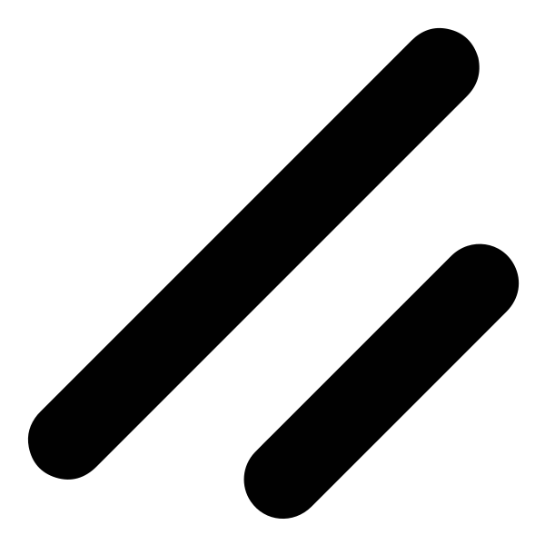

<h1 align="center">Hi 👋, I'm Shrvan</h1>
<h3 align="center">An engineering undergrad </h3>

<h3 align="left">About:</h3>

- 🌱 I’m currently learning **n8n**
- 📫 Reach out: **shrvansudhakara@gmail.com**
- ⚡ Fun fact: **I love Shawarma**

<h3 align="left">Tech Stack:</h3>

    
    
    
    
    
    <a href="https://nextjs.org" target="_blank" rel="noopener noreferrer"
        ><picture>
            <source
                srcset="assets/nextjs-icon-dark.svg"
                media="(prefers-color-scheme: dark)" />
            <source
                srcset="assets/nextjs-icon-light.svg"
                media="(prefers-color-scheme: light)" />
            </picture
    ></a>
    
    <a href="https://ui.shadcn.com/" target="_blank" rel="noopener noreferrer"
        ><picture>
            <source
                srcset="assets/shadcn-icon-dark.svg"
                media="(prefers-color-scheme: dark)" />
            <source
                srcset="assets/shadcn-icon-light.svg"
                media="(prefers-color-scheme: light)" />
            </picture
    ></a>
    <a href="https://tailwindcss.com" target="_blank" rel="noopener noreferrer"
        ><picture>
            <source
                srcset="assets/tailwindcss-icon-dark.svg"
                media="(prefers-color-scheme: dark)" />
            <source
                srcset="assets/tailwindcss-icon-light.svg"
                media="(prefers-color-scheme: light)" />
            </picture
    ></a>
    
    
    
    
    <a href="https://expressjs.com" target="_blank" rel="noopener noreferrer"
        ><picture>
            <source
                srcset="assets/express-icon-dark.svg"
                media="(prefers-color-scheme: dark)" />
            <source
                srcset="assets/express-icon-light.svg"
                media="(prefers-color-scheme: light)" />
            </picture
    ></a>
    
    <a href="https://www.mongodb.com/" target="_blank" rel="noopener noreferrer"
        ><picture>
            <source
                srcset="assets/mongodb-icon-dark.svg"
                media="(prefers-color-scheme: dark)" />
            <source
                srcset="assets/mongodb-icon-light.svg"
                media="(prefers-color-scheme: light)" />
            </picture
    ></a>
    
    
    

<h3 align="left">Links:</h3>

    <a
        href="https://x.com/shrvansudhakara"
        target="_blank"
        rel="noopener noreferrer"
        ><picture>
            <source
                srcset="assets/x-icon-dark.svg"
                media="(prefers-color-scheme: dark)" />
            <source
                srcset="assets/x-icon-light.svg"
                media="(prefers-color-scheme: light)" />
            </picture
    ></a>
    <a
        href="https://linkedin.com/in/shrvansudhakara"
        target="_blank"
        rel="noopener noreferrer"
        ><picture>
            <source
                srcset="assets/linkedin-icon-dark.svg"
                media="(prefers-color-scheme: dark)" />
            <source
                srcset="assets/linkedin-icon-light.svg"
                media="(prefers-color-scheme: light)" />
            </picture
    ></a>
    
    <a
        href="https://www.leetcode.com/shrvansudhakara"
        target="_blank"
        rel="noopener noreferrer"
        ><picture>
            <source
                srcset="assets/leetcode-icon-dark.svg"
                media="(prefers-color-scheme: dark)" />
            <source
                srcset="assets/leetcode-icon-light.svg"
                media="(prefers-color-scheme: light)" />
            </picture
    ></a>

